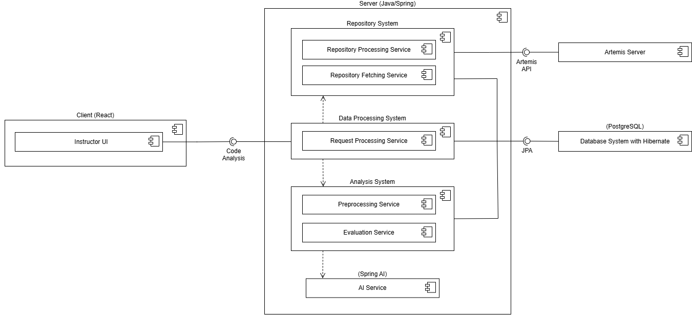

# 🌟 Harmonia – Evidence-Based Insights into Team Collaboration

**Harmonia** is an instructor-facing application designed to provide transparent, data-driven insights into how student
teams collaborate on programming assignments. It analyzes Git repositories to compute metrics, visualize evidence,
detect anomalies, and generate short written summaries — helping instructors understand team dynamics at a glance.

---

## 🎯 Project Idea

Harmonia serves as a **decision support system** by automatically analyzing Git repository activity for student teams
and computing a quantifiable **Collaboration Quality Index (CQI)**. The tool centralizes all collaboration evidence and
metrics into a single platform, enabling course staff to ensure fair and evidence-based assessment of teamwork.

### Key Features

* **On-Demand Analysis:** Instructors can trigger a new analysis job course-wide or per-team, with a high-performance
  target completion time of $\sim 15$ minutes for typical course sizes ($\sim 200$ teams).
* **Teams Overview Table:** A sortable and filterable dashboard of all teams, featuring key metrics:
    * **Course Averages** are prominently displayed to provide context for team-specific scores.
    * Quantitative data like **Total Commits**, **Lines Written**, and **Team Members**.
    * **Collaboration Quality Index (CQI)** (0-100 score).
* **Team Detail View:** An in-depth page providing comprehensive collaboration evidence, including:
    * The final **CQI** and all contributing sub-scores.
    * A concise, AI-generated **Short Narrative Report** summarizing activity and referencing key commits.

---

## 🧱 Architecture

Harmonia is built as a Java/Spring-based monolith, prioritizing stability and job orchestration performance.

## 💻 Technology Stack

| Component | Technology                   |
|:----------|:-----------------------------|
| Client    | React 19.2 + TypeScript      |
| Server    | Spring Boot (Jave)           |
| Database  | PostgreSQL 18 with Hibernate |
| AI        | Spring AI (OpenAI)           |

## UML Diagram



---

## 🐳 Run Harmonia with Docker

### Full stack (database + server + client)

1. Build and launch everything:

   ```bash
   docker compose -f docker/docker-compose.yml up --build
   ```

3. Access the services:
   * Client (served by nginx): http://localhost:4173
   * Spring Boot server: http://localhost:8080
   * PostgreSQL: localhost:5432 (user `postgres`, password `harmonia`)

The Compose setup builds the Gradle boot jar inside `docker/server.Dockerfile`, bundles the React client with Vite via `docker/client.Dockerfile`, and proxies `/api` + `/actuator` calls from nginx to the server container. All images restart automatically unless stopped.

### Database only

If you only need the database for local development you can start just the PostgreSQL service:

```bash
docker compose -f docker/docker-compose.yml up -d postgres
```

## 🚀 How to Run the Server

The application uses Gradle for dependency management and building. Assuming you have **Java 25** installed, use the
following commands to build and run the server locally:

1. Make sure to run the Docker container.

2. **Build the Project:** Compile the server application.

   | OS                         | Command to Build Project        |
          |:---------------------------|:--------------------------------|
   | macOS                      | `./gradlew clean build -x test` |
   | Windows                    | `.\gradlew clean build -x test` |

3. **Run the Server:** Start the Spring Boot application.

   | OS                         | Command to Run Server |
         |:---------------------------|:----------------------|
   | macOS                      | `./gradlew bootRun`   |
   | Windows                    | `.\gradlew bootRun`   |

---

## Useful Dependencies

#### `tailwind-merge`

- Merges Tailwind classes and resolves conflicts (e.g., `px-2` vs. `px-4`)
- Needed for shadcn/ui components that combine base & conditional styles
- **Example:**
    ```ts
    const classes = twMerge(
      "px-4 py-2 text-sm text-gray-500",  // base styles
      isActive && "text-blue-600 font-bold" // conditional styles
     );
    ```

#### `clsx`

- Utility for conditional className construction
- Cleaner and more readable than manual string concatenation

## 📘 OpenAPI Workflow (Server → React Client)

Harmonia uses SpringDoc to automatically generate an OpenAPI 3.0 specification, which is then used to generate a fully typed React client (TypeScript + Axios).

Whenever you update server-side code (controllers, DTOs, response models, etc.), you must regenerate:
1.	The OpenAPI YAML file
2.	The React service code

⸻

### 🔄 Step 1 — Generate the OpenAPI Specification

Run the following command to start the application in the special openapi profile and produce the latest openapi.yaml file:

```bash
    ./gradlew generateApiDocs -x webapp --stacktrace
```

The generated file will be located at:

/openapi/openapi.yaml

### 🔄 Step 2 — Generate the React Client Code

Once the OpenAPI spec is updated, generate the React API services:

```bash
    ./gradlew openApiGenerate
```

This will generate fully typed API clients and models in:

src/main/webapp/src/app/generated/

These files are overwritten each time you run the generator and should be committed to version control to keep client and server in sync.
